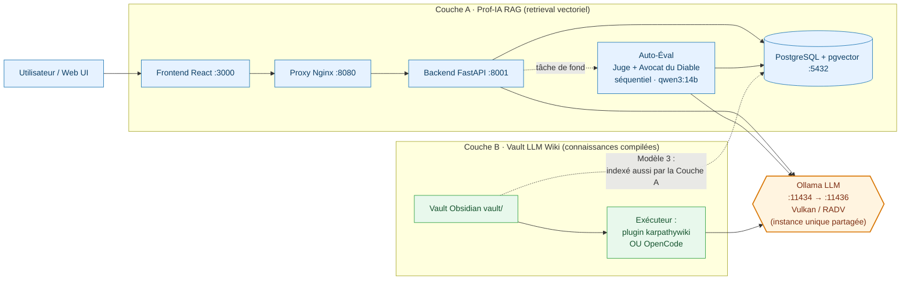
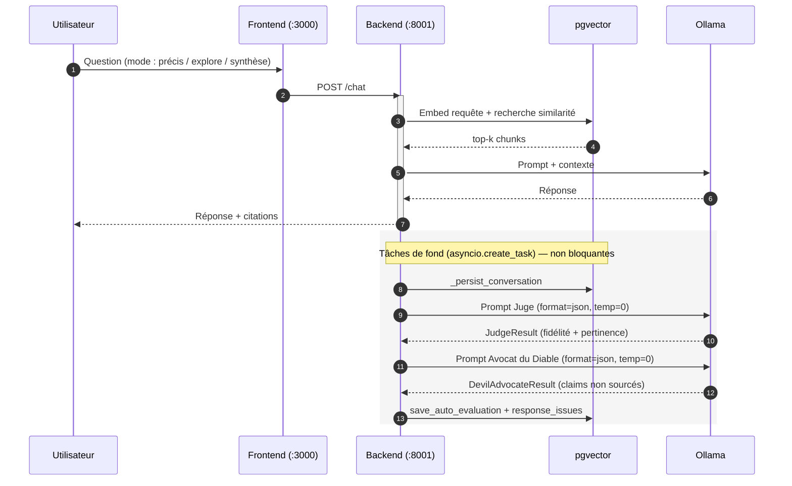
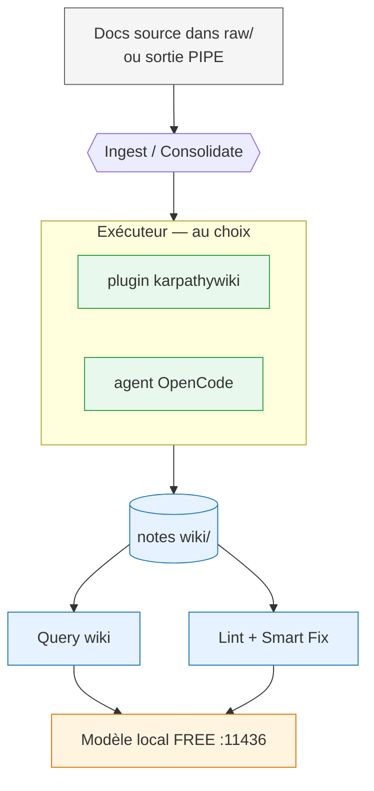

# RAG-Harvard-IT-teacher

> **Prof-IA** — un assistant RAG d'enseignement **100 % local** pour les
> cursus IT (TSSR / AIS / DevOps), augmenté d'un **vault LLM Wiki**
> (**Modèle 3 — LLM Wiki + RAG**) et de la discipline de provenance **OKF**.
> Pas de cloud, pas de clé API, pas d'appel externe : tout tourne sur votre
> matériel.

[](#)
[](#)
[](#)

---

## Sommaire

1. [Vue d'ensemble](#1-vue-densemble)
2. [Architecture (hybride Modèle 3)](#2-architecture-hybride-modèle-3)
3. [Couche A — Moteur RAG Prof-IA](#3-couche-a--moteur-rag-prof-ia)
4. [Couche B — Vault LLM Wiki](#4-couche-b--vault-llm-wiki)
5. [Démarrage rapide](#5-démarrage-rapide)
6. [Arborescence du projet](#6-arborescence-du-projet)
7. [Datasets & fine-tuning](#7-datasets--fine-tuning)
8. [Confidentialité & matériel](#8-confidentialité--matériel)
9. [Références](#9-références)

---

## 1. Vue d'ensemble

Ce dépôt livre **deux couches de connaissances complémentaires** au-dessus
d'une même stack de modèles locale :

| Couche | Rôle | Technologie |
|---|---|---|
| **A · Moteur RAG** | Retrieval vectoriel sur le cours + chat | FastAPI, PostgreSQL + pgvector, Ollama (Vulkan), React |
| **B · Vault LLM Wiki** | Base de connaissances compilée et auto-maintenue | Vault Obsidian + plugin `karpathywiki` **ou** OpenCode |

La combinaison est le pattern **Modèle 3 — LLM Wiki + RAG** : le moteur RAG
répond avec des chunks récupérés, tandis que le LLM Wiki stocke une
*connaissance distillée, liée et sourcée* que la couche RAG peut également
indexer. Les deux couches sont maintenues par des **modèles locaux FREE**
(Ollama), jamais Claude ni une API cloud.

Les principes **OKF** (Open Knowledge Foundation) sont appliqués dans le vault
via `vault/AGENTS.md` (« The Schema ») : chaque note porte sa provenance
(`sources`), un `statut` de confiance et des `[[wiki-links]]` typées.

---

## 2. Architecture (hybride Modèle 3)



**Flux d'une requête RAG**



**Flux de maintenance du LLM Wiki (exécuteur agnostique)**



---

## 3. Couche A — Moteur RAG Prof-IA

| Composant | Image / Tech | Port | Notes |
|---|---|---|---|
| PostgreSQL + pgvector | `pgvector/pgvector:pg18` | `127.0.0.1:5432` | Base vectorielle (`rag_chunks`, HNSW) |
| Ollama (LLM) | `ollama/ollama:latest` | `127.0.0.1:11434` (interne) → `:11436` (hôte) | Backend Vulkan/RADV sur AMD RDNA2 ; une seule instance sert RAG + vault |
| Backend FastAPI | Python 3.13 (build local) | `0.0.0.0:8001→8000` | Moteur RAG async |
| Frontend React | Node 20 (build local) | `0.0.0.0:3000` | 3 designs d'UI |
| Nginx | `nginx:alpine` | `0.0.0.0:8080` | Reverse proxy |

- **Embeddings :** `BAAI/bge-m3` (1024 dim) — meilleur choix local pour le FR (MTEB).
- **Modèles LLM :** servis par **Ollama** (OpenAI-compatible) sur `:11436` (hôte) / `:11434` (interne docker) — une seule instance sert à la fois le backend RAG et le vault. Modèle principal : `qwen3:14b` (Qwen3-14B, Q4_K_M, ~9,3 Go) — **tient intégralement dans les ~12 Go VRAM** du BC-250 (GPU plein, sans offload partiel). À récupérer avec :
  ```bash
  ollama pull qwen3:14b
  ```
  (tout endpoint OpenAI-compatible, ex. llama.cpp/LM Studio, peut remplacer Ollama — Ollama est le défaut choisi).
- **Réglage VRAM — `num_ctx` (qwen3:14b) :** le modèle étant en VRAM pleine, un contexte sain passe sans problème :
  - ops vault légères (Ingest / petit Query) : **1024**
  - RAG profond / chat long : **8192**
  Épingler via un Modelfile si besoin :
  ```bash
  cat > Modelfile <<'EOF'
  FROM qwen3:14b
  PARAMETER num_ctx 8192
  EOF
  ollama create qwen3-14b -f Modelfile
  ```
- **Modes RAG :** `précis` (top-5), `explore` (MMR top-12), `synthèse` (multi-query top-20).
- **Entrées :** PDF, DOCX, PPTX, XLSX, TXT, MD, plus audio/vidéo via Whisper.
- **Endpoints :** `/chat`, `/documents/upload`, `/indexing/directory`,
  `/datasets/stats`, `/models/switch`, `/services/{start,stop,restart}`, …
- **Auto-évaluation (Juge + Avocat du Diable) :** après chaque réponse `/chat`
  le backend lance *optionnellement* un Juge + un Avocat du Diable sur le même
  modèle `qwen3:14b` (activé par `AUTO_EVALUATE`). Les résultats vont dans
  `response_evaluations` + `response_issues` (voir §7). Tourne **séquentiellement**
  sur le seul modèle chargé — pas de chargement parallèle, pas de VRAM en plus.

Tous les services sont reliés via le bridge Docker `prof-ia-network` ; seuls
Nginx, le frontend et le backend sont exposés sur le LAN — PostgreSQL et Ollama
restent en loopback.

---

## 4. Couche B — Vault LLM Wiki

`vault/` est un **vault Obsidian** de connaissances compilées, fondé sur le
concept [LLM Wiki (Karpathy)](https://github.com/karpathy/llm/wiki) et la
référence [lucasastorian/llmwiki](https://github.com/lucasastorian/llmwiki).

Il est **agnostique sur l'exécuteur** — maintenu indifféremment par :

- **Plugin Obsidian `karpathywiki`** (`green-dalii/obsidian-llm-wiki`) —
  commandes *Ingest* (= consolidate), *Query*, *Lint* ; le retrieval est un
  **Personalized PageRank sur les `[[wiki-links]]`** (pas d'embeddings).
- **Agent OpenCode** — suit `vault/AGENTS.md` comme « The Schema » et édite
  les mêmes fichiers Markdown.

Les deux utilisent le **même format de fichier** (Markdown + frontmatter +
`[[wiki-links]]`), donc les exécuteurs sont interchangeables.

| Chemin | Rôle |
|---|---|
| `vault/AGENTS.md` | « The Schema » : structure, frontmatter, règles OKF (enforced par `okf-enforcer`) |
| `vault/wiki/index.md` | Vue d'ensemble générée (régénérée par le plugin) |
| `vault/wiki/{sources,entities,concepts}/` | Notes typées |
| `vault/raw/` | Dépôt des docs source (sortie PIPE, etc.) |
| `vault/log.md` | Journal de maintenance OKF |
| `vault/docs/superpowers/specs/` | Spécifications de conception |

**Frontmatter OKF** (par note, enforce par le plugin Obsidian `okf-enforcer`) :
`type`, `title`, `description`, `resource`, `status` (`draft`/`stable`/`deprecated`),
`stale_after`, `tags`, `generated`/`verified` (`by`/`at`), `sources` (objets
`uri`/`author`/`last_modified`). Plus l'extension Modèle 3 `statut` (confiance).

---

## 5. Démarrage rapide

```bash
# 1. Configuration (obligatoire — compose refuse de démarrer sans cela)
cp .env.example .env
python3 -c "import secrets; print('POSTGRES_PASSWORD=' + secrets.token_urlsafe(24))" >> .env
python3 -c "import secrets; print('API_TOKEN=' + secrets.token_urlsafe(32))" >> .env

# 2. Lancer la stack RAG
docker compose up -d

# 3. Vérification de santé
curl http://localhost:8001/health

# 4. Ouvrir l'application
#    Frontend : http://localhost:3000
#    Proxy    : http://localhost:8080
```

**Utiliser le vault LLM Wiki :**

- *Route Obsidian :* ouvrez `vault/` dans Obsidian, installez le plugin
  `karpathywiki`, pointez-le sur un endpoint OpenAI-compatible local
  (`127.0.0.1:11436`, `WIKI_API_KEY=unused`), puis lancez **Ingest** / **Query**
  / **Lint**.
- *Route OpenCode :* ouvrez le dépôt dans OpenCode et laissez-le suivre
  `vault/AGENTS.md` (Ingest → `raw/`, Consolidate → `wiki/`, Lint → corrige les notes).

---

## 6. Arborescence du projet

```text
RAG-Harvard-IT-teacher/
├── docker-compose.yml        # Orchestration de la stack RAG
├── .env.example              # Secrets requis (POSTGRES_PASSWORD, API_TOKEN)
├── backend/                  # FastAPI + moteur RAG + processeurs de docs
│   ├── api/{main,rag_engine,config,database,document_processor,evaluation}.py
│   └── tests/test_evaluation.py  # 22 tests (Juge + Avocat du Diable + UPSERT)
├── frontend/                 # UI React (Terminal / Dashboard / Minimal)
├── config/nginx.conf         # Reverse proxy
├── fine_tuning/              # Entraînement LoRA (train.py, config.yaml)
├── scripts/                  # check_long_lines.py, bc250 helpers (Bazzite)
├── AMD-BC-250-at-his-Best/   # Toolkit bc250-beast inclus (déblocage/OC matériel)
├── vault/                    # ← Couche B : vault LLM Wiki (Modèle 3 + OKF)
│   ├── AGENTS.md             # The Schema
│   ├── wiki/{index,sources,entities,concepts}/
│   ├── raw/                  # dépôt des docs source
│   └── log.md
├── README.md                 # Ce fichier (EN)
├── README.fr.md              # Version française
├── Prof-IA-v5-Documentation-BC250.md
└── fait.md
```

---

## 7. Datasets & boucle de feedback

- **Les sources sont fournies par l'utilisateur.** Déposez vos documents dans
  `vault/raw/` (ou uploadez via `/documents/upload`) — la vault **n'inclut
  aucun dataset pré-emballé**. Le pipeline extrait, découpe, embed (BGE-M3) et
  indexe dans pgvector sur les 16 Go GDDR6 du BC-250.
- **Boucle de feedback humain (implémentée).** Chaque réponse `/chat` renvoie
  un `conversation_id`. POST `/feedback` avec cet id (optionnellement
  `human_rating` 1–5, `human_feedback`, `is_golden=true`) pour le persister
  dans `response_evaluations`. `fine_tuning/train.py` lit les lignes
  `is_golden` pour construire le jeu SFT JSONL golden.
- **LoRA :** `fine_tuning/train.py` (PEFT + SFTTrainer, fp16, r=16) transforme
  le jeu golden en un modèle Ollama personnalisé — boucle d'amélioration locale.
- **Auto-évaluation (Juge + Avocat du Diable) — implémentée.** Après chaque
  réponse, `run_evaluation` tourne **séquentiellement** (modèle unique
  `qwen3:14b`, `format=json`, `temp=0`) :
  1. **Juge** — note `fidélité` (0–1) + `pertinence` (0–1) + `verdict`
     (`good`/`needs_improvement`/`bad`).
  2. **Avocat du Diable** — liste les `claims` non supportés par le contexte.
  L'`AutoEvaluationPayload` est persisté via `save_auto_evaluation`
  (UPSERT symétrique, idempotent, clé = `evaluation_run_id` déterministe),
  plus `response_issues` (UNIQUE sur `conversation_id`+`evaluation_run_id`+
  `issue_type`+`claim_hash`). Réglages qualité : `EVAL_TIMEOUT_S=15`,
  `EVAL_NUM_PREDICT=150`, `EVAL_NUM_CTX=2048`, `EVAL_SAMPLE_RATE=1.0`
  (tout est scoré — latence tolérée). Désactivé par défaut
  (`AUTO_EVALUATE=false` dans `docker-compose.yml`) ; activation = commit isolé
  + tag `v6.1-auto-eval`. Calibrer sur 20 golden (Pearson r ≥ 0,7) avant
  activation.

---

## 8. Confidentialité & matériel

- **100 % local.** Aucune télémétrie, aucune API externe, aucun modèle cloud.
  Adapté aux réseaux air-gapped / salles de classe.
- **Matériel cible :** AMD BC-250 (Cyan Skillfish, RDNA2) avec ROCm 7.2 pour
  les embeddings et Vulkan/RADV pour Ollama ; repli CPU possible.
- **Les modèles sont FREE et hébergés localement** (Ollama). Le
  vault n'appelle jamais Claude ni un endpoint payant.

### 8.1 AMD BC-250 (matériel cible)

La stack est optimisée pour l'**AMD BC-250** — un APU PS5 sous-exploité
(carte de minage recyclée) avec 6 cœurs Zen-2 et 24 CUs RDNA2 (jusqu'à 40
débloquables). Pour libérer tout son potentiel en hôte Linux, utilisez le
toolkit compagnon **bc250-beast** — inclus dans ce dépôt via
[`AMD-BC-250-at-his-Best/`](AMD-BC-250-at-his-Best/)
(amont : <https://github.com/chelmooz/AMD-BC-250-at-his-Best>), qui
orchestre les outils communautaires validés derrière un seul `install.sh`.
Pour la couche OS/matériel BC-250, la **source de vérité** est la documentation
communautaire : <https://elektricm.github.io/amd-bc250-docs/> et le guide
serveur Ollama+Vulkan <https://github.com/akandr/bc250>.

| Optimisation | Résultat |
|---|---|
| Déblocage cœurs CPU | 6c/12t → 8c/16t (persistant via systemd) |
| Déblocage CUs GPU | 24 → jusqu'à 40 CUs (« on the fly ») |
| Overclock / undervolt SMU | sweet spot ~3,85 GHz / 1150 mV |
| Budget VRAM | 512 Mo → 12 Go pour LLM + embeddings |
| Réglages système | zswap, mitigations off, MangoHud |
| OS recommandé | **Bazzite** (Fedora immuable) — support natif |

> ⚠️ **Sécurité matériel :** ne jamais dépasser **CPU Vid > 1300 mV** (risque
> de brick confirmé) et garder l'horloge GPU ≤ ~2,2–2,4 GHz en refroidissement
> air sans watercooling ni alimentation supplémentaire. Stresser toujours les
> cœurs/CUs débloqués avant de s'y fier.

Le serveur de modèles est **Ollama** (une seule instance docker, interne `:11434`, exposée sur l'hôte `:11436` pour que le vault et les outils LAN l'atteignent — le backend utilise l'interne `:11434`). Récupérer le modèle une fois :
```bash
ollama pull qwen3:14b
```
Le modèle Q4 de ~9,3 Go **tient entièrement dans les ~12 Go VRAM** du BC-250 (GPU plein, sans offload partiel) — rapide et stable.

Prof-IA utilise **ROCm** pour les embeddings et **Vulkan/RADV** pour Ollama —
les deux tournent nativement une fois le BC-250 débloqué ; repli CPU sinon.

---

## 9. Références

- Concept LLM Wiki — <https://github.com/karpathy/llm/wiki>
- Plugin Obsidian `karpathywiki` — <https://github.com/green-dalii/obsidian-llm-wiki>
- Impl. référence LLM Wiki — <https://github.com/lucasastorian/llmwiki>
- Modèle 3 (LLM Wiki + RAG) — vue d'ensemble glukhov.org knowledge-management
- OKF — Google Cloud Open Knowledge Format : <https://github.com/GoogleCloudPlatform/open-knowledge-format>
- Docs communautaires AMD BC-250 — <https://elektricm.github.io/amd-bc250-docs/> (référence BC-250 primaire)
- Serveur AMD BC-250 Ollama + Vulkan — <https://github.com/akandr/bc250> (valide le serving LLM local)
- Optimisation AMD BC-250 — <https://github.com/chelmooz/AMD-BC-250-at-his-Best> (toolkit `bc250-beast`)
