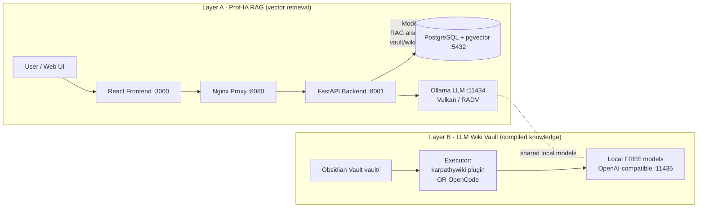
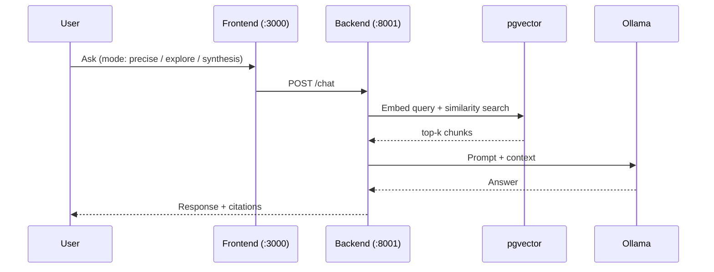
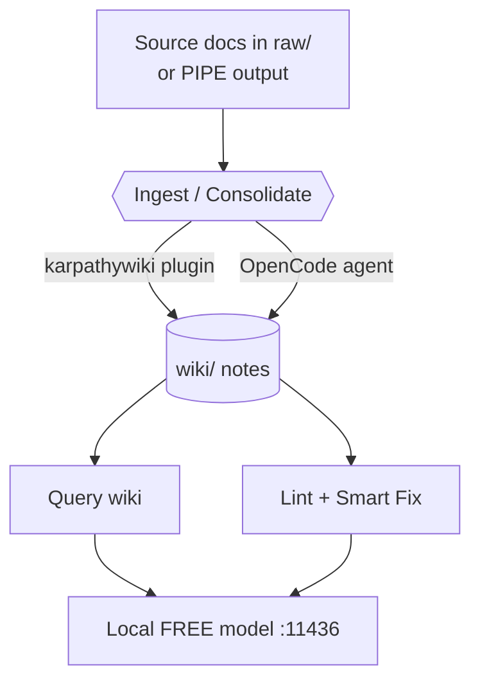

# RAG-Harvard-IT-teacher

> **Prof-IA** — a fully **local** RAG teaching assistant for IT curricula
> (TSSR / AIS / DevOps), augmented with a **LLM Wiki knowledge vault**
> (**Modèle 3 — LLM Wiki + RAG**) and **OKF** provenance discipline.
> No cloud, no API keys, no external calls: everything runs on your own hardware.

[](#)
[](#)
[](#)

---

## Table of Contents

1. [Overview](#1-overview)
2. [Architecture (Modèle 3 hybrid)](#2-architecture-modèle-3-hybrid)
3. [Layer A — Prof-IA RAG engine](#3-layer-a--prof-ia-rag-engine)
4. [Layer B — LLM Wiki vault](#4-layer-b--llm-wiki-vault)
5. [Quick start](#5-quick-start)
6. [Project structure](#6-project-structure)
7. [Datasets & fine-tuning](#7-datasets--fine-tuning)
8. [Privacy & hardware](#8-privacy--hardware)
9. [References](#9-references)

---

## 1. Overview

This repository ships **two complementary knowledge layers** on top of a single
local model stack:

| Layer | Role | Technology |
|---|---|---|
| **A · RAG engine** | Vector retrieval over course material + chat | FastAPI, PostgreSQL + pgvector, Ollama (Vulkan), React |
| **B · LLM Wiki vault** | Compiled, self-maintained knowledge base | Obsidian vault + `karpathywiki` plugin **or** OpenCode |

The combination is the **Modèle 3 — LLM Wiki + RAG** pattern: the RAG engine
answers with retrieved chunks, while the LLM Wiki stores *distilled, linked,
source-cited knowledge* that the RAG layer can also index. Both layers are
maintained by **local FREE models** (Ollama), never Claude or a
cloud API.

**OKF principles** (Open Knowledge Foundation style) are enforced in the vault
via `vault/AGENTS.md` ("The Schema"): every note carries provenance
(`sources`), a confidence `statut`, and typed `[[wiki-links]]`.

---

## 2. Architecture (Modèle 3 hybrid)



**RAG request flow**



**LLM Wiki maintenance flow (executor-agnostic)**



---

## 3. Layer A — Prof-IA RAG engine

| Component | Image / Tech | Port | Notes |
|---|---|---|---|
| PostgreSQL + pgvector | `pgvector/pgvector:pg18` | `127.0.0.1:5432` | Vector store (`rag_chunks`, HNSW) |
| Ollama (LLM) | `ollama/ollama:latest` | `127.0.0.1:11434` (internal) → `:11436` (host) | Vulkan/RADV backend on AMD RDNA2; one instance serves RAG + vault |
| FastAPI backend | Python 3.13 (local build) | `0.0.0.0:8001→8000` | Async RAG engine |
| React frontend | Node 20 (local build) | `0.0.0.0:3000` | 3 UI designs |
| Nginx | `nginx:alpine` | `0.0.0.0:8080` | Reverse proxy |

- **Embeddings:** `BAAI/bge-m3` (1024-dim) — best local choice for French (MTEB).
- **LLM models:** served by **Ollama** (OpenAI-compatible) on `:11436` (host) / `:11434` (docker internal) — one instance serves both the RAG backend and the vault. Primary model: `qwen3:14b` (Qwen3-14B, Q4_K_M, ~9.3 GB) — fits **fully in the BC-250's ~12 GB VRAM** (full GPU, no partial offload). Pull it with:
  ```bash
  ollama pull qwen3:14b
  ```
  (any OpenAI-compatible endpoint, e.g. llama.cpp/LM Studio, can be substituted — Ollama is the chosen default).
- **VRAM tuning — `num_ctx` (qwen3:14b):** with the model fully in VRAM, a healthy context fits comfortably:
  - light vault ops (Ingest / small Query): **1024**
  - deep RAG / long chat: **8192**
  Pin it per model via a Modelfile if needed:
  ```bash
  cat > Modelfile <<'EOF'
  FROM qwen3:14b
  PARAMETER num_ctx 8192
  EOF
  ollama create qwen3-14b -f Modelfile
  ```
- **RAG modes:** `precise` (top-5), `explore` (MMR top-12), `synthesis` (multi-query top-20).
- **Inputs:** PDF, DOCX, PPTX, XLSX, TXT, MD, plus audio/video via Whisper.
- **Endpoints:** `/chat`, `/documents/upload`, `/indexing/directory`,
  `/datasets/stats`, `/models/switch`, `/services/{start,stop,restart}`, …

All services are wired through the `prof-ia-network` Docker bridge; only Nginx,
the frontend and the backend are exposed on the LAN — PostgreSQL and Ollama stay
on loopback.

---

## 4. Layer B — LLM Wiki vault

`vault/` is an **Obsidian vault** of compiled knowledge, built on the
[LLM Wiki (Karpathy)](https://github.com/karpathy/llm/wiki) concept and the
[lucasastorian/llmwiki](https://github.com/lucasastorian/llmwiki) reference.

It is **executor-agnostic** — maintained by either:

- **Obsidian `karpathywiki` plugin** (`green-dalii/obsidian-llm-wiki`) —
  commands *Ingest* (= consolidate), *Query*, *Lint*; retrieval is
  **Personalized PageRank over `[[wiki-links]]`** (no embeddings needed).
- **OpenCode** agent — follows `vault/AGENTS.md` as "The Schema" and edits the
  same Markdown files.

Both use the **same file format** (Markdown + frontmatter + `[[wiki-links]]`),
so the two executors are interchangeable.

| Path | Purpose |
|---|---|
| `vault/AGENTS.md` | "The Schema": structure, frontmatter, OKF rules (enforced by `okf-enforcer`) |
| `vault/wiki/index.md` | Generated overview (regenerated by the plugin) |
| `vault/wiki/{sources,entities,concepts}/` | Typed notes |
| `vault/raw/` | Drop folder for source docs (PIPE output, etc.) |
| `vault/log.md` | OKF maintenance log |
| `vault/docs/superpowers/specs/` | Design specs |

**OKF frontmatter** (per note, enforced by the `okf-enforcer` Obsidian plugin):
`type`, `title`, `description`, `resource`, `status` (`draft`/`stable`/`deprecated`),
`stale_after`, `tags`, `generated`/`verified` (`by`/`at`), `sources` (objects
`uri`/`author`/`last_modified`). Plus the Modèle 3 extension `statut` (confiance).

---

## 5. Quick start

```bash
# 1. Configure (mandatory — compose refuses to start without these)
cp .env.example .env
python3 -c "import secrets; print('POSTGRES_PASSWORD=' + secrets.token_urlsafe(24))" >> .env
python3 -c "import secrets; print('API_TOKEN=' + secrets.token_urlsafe(32))" >> .env

# 2. Launch the RAG stack
docker compose up -d

# 3. Health check
curl http://localhost:8001/health

# 4. Open the app
#    Frontend : http://localhost:3000
#    Proxy    : http://localhost:8080
```

**Use the LLM Wiki vault:**

- *Obsidian route:* open `vault/` in Obsidian, install the `karpathywiki`
  plugin, point it at a local OpenAI-compatible endpoint
  (`127.0.0.1:11436`, `WIKI_API_KEY=unused`), then run **Ingest** / **Query** /
  **Lint**.
- *OpenCode route:* open the repo in OpenCode and let it follow
  `vault/AGENTS.md` (Ingest → `raw/`, Consolidate → `wiki/`, Lint → fix notes).

---

## 6. Project structure

```text
RAG-Harvard-IT-teacher/
├── docker-compose.yml        # Orchestrates the RAG stack
├── .env.example              # Required secrets (POSTGRES_PASSWORD, API_TOKEN)
├── backend/                  # FastAPI + RAG engine + doc processors
│   └── api/{main,rag_engine,config,database,document_processor}.py
├── frontend/                 # React UI (Terminal / Dashboard / Minimal)
├── config/nginx.conf         # Reverse proxy
├── fine_tuning/              # LoRA training (train.py, config.yaml)
├── scripts/                  # unlock-40cu.sh, check_long_lines.py
├── AMD-BC-250-at-his-Best/   # Vendored bc250-beast toolkit (HW unlock/OC)
├── vault/                    # ← Layer B: LLM Wiki vault (Modèle 3 + OKF)
│   ├── AGENTS.md             # The Schema
│   ├── wiki/{index,sources,entities,concepts}/
│   ├── raw/                  # source drop folder
│   └── log.md
├── README.md                 # This file
├── README.fr.md              # French version
├── Prof-IA-v5-Documentation-BC250.md
└── fait.md
```

---

## 7. Datasets & feedback loop

- **Sources are user-supplied.** Drop your own documents into `vault/raw/`
  (or upload via `/documents/upload`) — the vault ships **no pre-bundled
  datasets**. The pipeline extracts, chunks, embeds (BGE-M3) and indexes them
  in pgvector on the BC-250's 16 GB GDDR6.
- **Human feedback loop (implemented).** Every `/chat` response returns a
  `conversation_id`. POST `/feedback` with that id (optionally
  `human_rating` 1–5, `human_feedback`, `is_golden=true`) to persist it in
  `response_evaluations`. `fine_tuning/train.py` reads `is_golden` rows to
  build the SFT JSONL golden set.
- **LoRA**: `fine_tuning/train.py` (PEFT + SFTTrainer, fp16, r=16) turns the
  golden set into a custom Ollama model — closing the local improvement loop.
- **Auto-scoring (planned, not wired).** `AUTO_EVALUATE` defaults to `False`:
  no LLM-judge score is generated automatically in v6.0. The optional
  auto-scoring job (threshold `GOLDEN_THRESHOLD=0.85`) is future work.

---

## 8. Privacy & hardware

- **100% local.** No telemetry, no external API, no cloud model. Suitable for
  air-gapped / classroom networks.
- **Target hardware:** AMD BC-250 (Cyan Skillfish, RDNA2) with ROCm 7.2 for
  embeddings and Vulkan/RADV for Ollama inference; falls back to CPU.
- **Models are FREE and locally hosted** (Ollama). The vault never
  calls Claude or any paid endpoint.

### 8.1 AMD BC-250 (target hardware)

The stack is tuned for the **AMD BC-250** — a cut-down PS5 APU (recycled
mining board) with 6 Zen-2 cores and 24 RDNA2 CUs (up to 40 unlockable).
To unlock its full potential as a Linux host, use the companion toolkit
**bc250-beast** — vendored in this repo at
[`AMD-BC-250-at-his-Best/`](AMD-BC-250-at-his-Best/)
(upstream: <https://github.com/chelmooz/AMD-BC-250-at-his-Best>), which
orchestrates the validated community tools behind a single `install.sh`.
For the BC-250 OS/hardware layer, the **authoritative source** is the community
documentation: <https://elektricm.github.io/amd-bc250-docs/> and the Ollama+Vulkan
server guide <https://github.com/akandr/bc250>.

| Optimization | Result |
|---|---|
| CPU core unlock | 6c/12t → 8c/16t (persistent via systemd) |
| GPU CU unlock | 24 → up to 40 CUs ("on the fly") |
| SMU overclock / undervolt | sweet spot ~3.85 GHz / 1150 mV |
| VRAM budget | 512 MB → 12 GB for LLM + embeddings |
| System tuning | zswap, mitigations off, MangoHud |
| Recommended OS | **Bazzite** (immutable Fedora) — first-class support |

> **Install paths (BC-250).** Two supported routes, pick one:
> - **Bazzite** (recommended): `scripts/bazzite/setup.sh` (rpm-ostree kargs, governor COPR, env ROCm). Userspace BC-250 optimizations live in `scripts/bc250/` (40 CU via UMR, 8c unlock + UV/OC via SMU — all MIT, see `CREDITS.md`).
> - **Debian 13 / ROCm 7.2**: `install.sh` (apt + GRUB). *Not* for immutable Bazzite.
>
> 📘 **Full step-by-step install guide** (BIOS flash, BIOS settings, Bazzite install, driver
> config, service verification): [`BC-250-INSTALL-GUIDE.md`](BC-250-INSTALL-GUIDE.md).

> ⚠️ **Hardware safety:** never exceed **CPU Vid > 1300 mV** (confirmed brick
> risk) and keep GPU clocks ≤ ~2.2–2.4 GHz on air cooling unless watercooling
> and extra power delivery are present. Always stress-test unlocked cores/CUs
> before relying on them.

The model server is **Ollama** (single docker instance, internal `:11434`, exposed on the host at `:11436` so the vault and LAN tools reach it — the backend uses the internal `:11434`). Pull the model once:
```bash
ollama pull qwen3:14b
```
The ~9.3 GB Q4 model fits **entirely in the BC-250's ~12 GB VRAM** (full GPU, no partial offload) — fast and stable.

Prof-IA uses **ROCm** for embeddings and **Vulkan/RADV** for Ollama inference —
both run natively once the BC-250 is unlocked; it falls back to CPU otherwise.

---

## 9. References

- LLM Wiki concept — <https://github.com/karpathy/llm/wiki>
- `karpathywiki` Obsidian plugin — <https://github.com/green-dalii/obsidian-llm-wiki>
- LLM Wiki reference impl — <https://github.com/lucasastorian/llmwiki>
- Modèle 3 (LLM Wiki + RAG) — glukhov.org knowledge-management overview
- OKF — Google Cloud Open Knowledge Format: <https://github.com/GoogleCloudPlatform/open-knowledge-format>
- AMD BC-250 community docs — <https://elektricm.github.io/amd-bc250-docs/> (primary BC-250 reference)
- AMD BC-250 Ollama + Vulkan server — <https://github.com/akandr/bc250> (validates local LLM serving)
- AMD BC-250 optimization — <https://github.com/chelmooz/AMD-BC-250-at-his-Best> (`bc250-beast` toolkit)

---

## 10. Acknowledgments

This project reuses community BC-250 research and code, all under the **MIT**
license. Authors are credited here (no authorship modification):

- **WinnieLV** / [bc250-cu-live-manager](https://github.com/WinnieLV/bc250-cu-live-manager) — 40 CU unlock via UMR
- **bc250-collective** / [bc250_smu_oc](https://github.com/bc250-collective/bc250_smu_oc) — CPU UV/OC via SMU
- **keyboardspecialist** / [bc250-steamos](https://github.com/keyboardspecialist/bc250-steamos) — 8-core unlock + RAM/VRAM split
- **rpf16rj** / [bc250-steamos-real-toolkit](https://github.com/rpf16rj/bc250-steamos-real-toolkit) — SMU toolkit reference
- **MastaG** / [linux-cachyos-bc250](https://github.com/MastaG/linux-cachyos-bc250) — kernel patches (Phase 2 opt-in)

See [`CREDITS.md`](CREDITS.md) for the full table.
